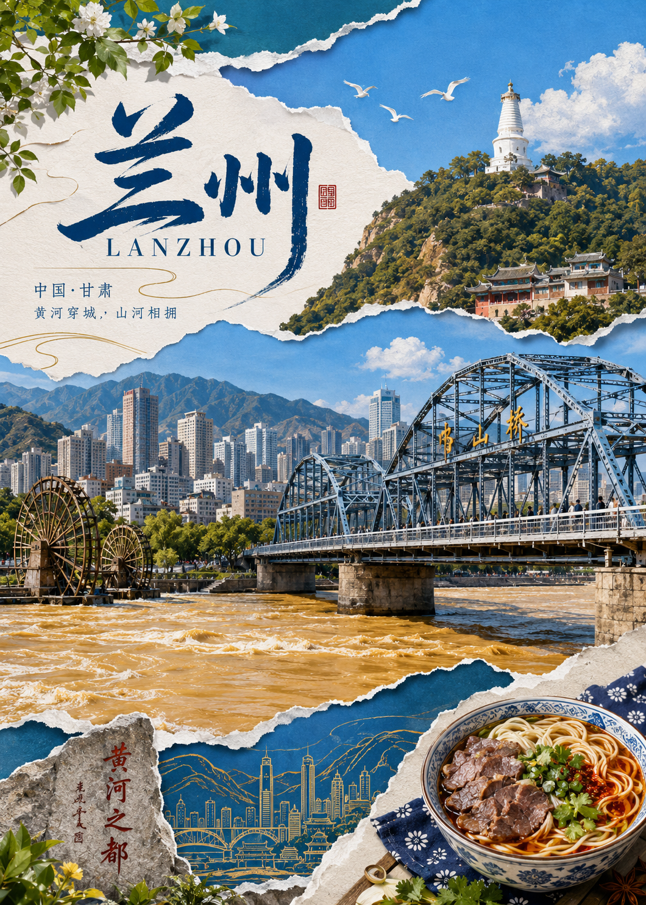
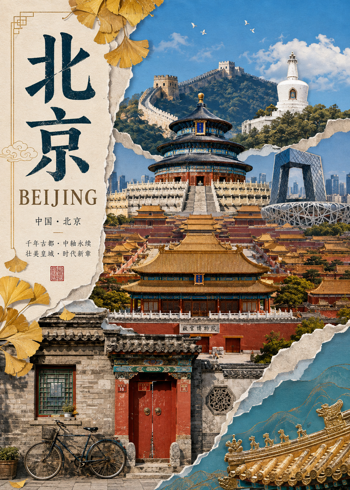
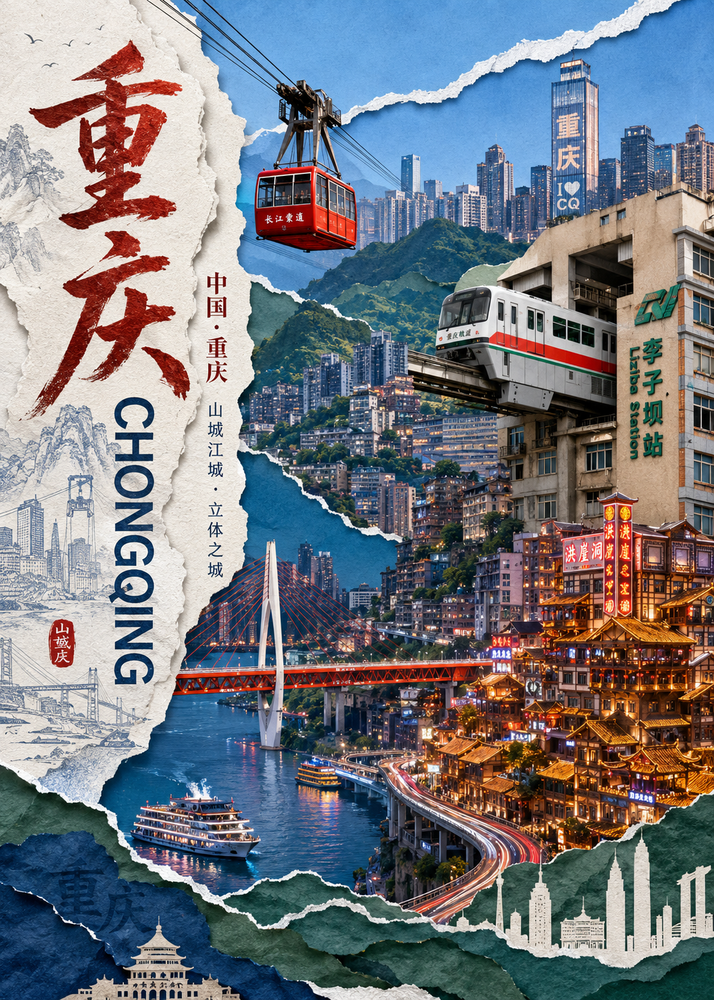
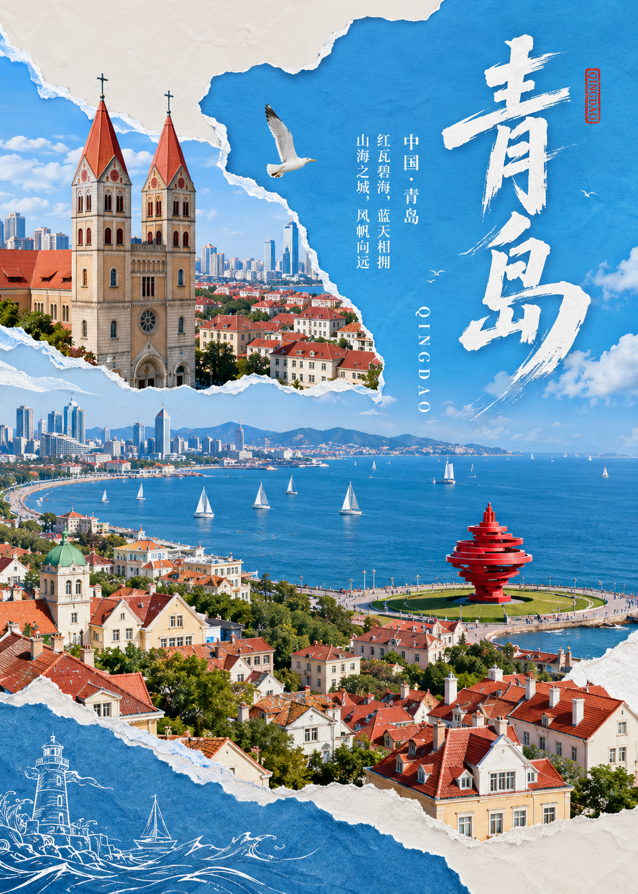
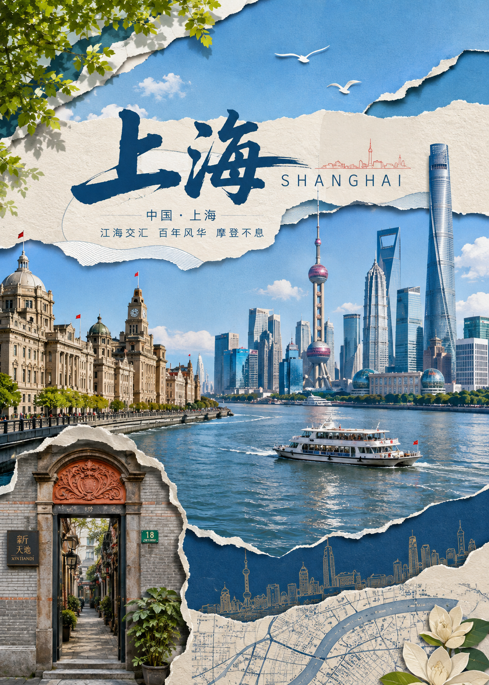
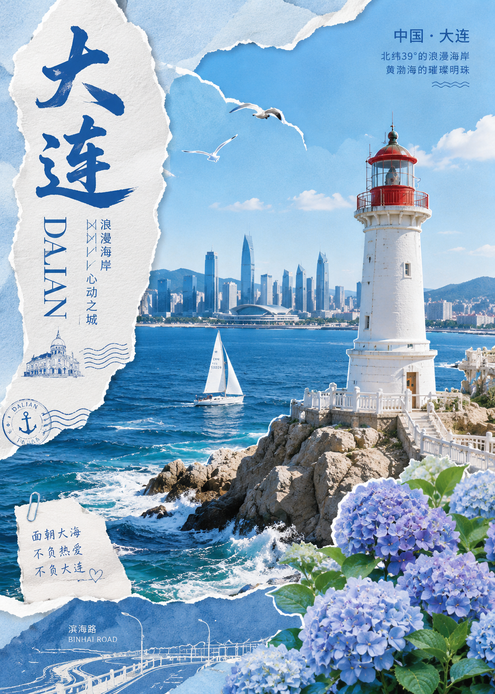

<div align="center">

# Destination Paper Collage Poster

### 城市视觉驱动的纸雕拼贴旅行海报 Skill

让不同城市保持统一的设计语言，同时避免落入同一个固定模板。

[English](README.md) · [简体中文](README.zh-CN.md) · [Skill](SKILL.md) · [版权规则](LICENSE.md)

</div>

---

## 六图展示


<table>
  <tr>
    <td width="33.33%"></td>
    <td width="33.33%"></td>
    <td width="33.33%"></td>
  </tr>
  <tr>
    <td width="33.33%"></td>
    <td width="33.33%"></td>
    <td width="33.33%"></td>
  </tr>
</table>

---

## 这个 Skill 是做什么的

`Destination Paper Collage Poster` 用于生成具有纸雕、撕纸、摄影剪贴和编辑设计感的城市 / 目的地旅行海报。

它不会把不同城市简单塞进同一个固定模板，而是先从目的地本身提取：

- 空间特征
- 建筑特征
- 文化特征
- 自然环境
- 交通与移动方式
- 材质特征
- 情绪气质

然后再决定这个城市自己的 **Hero Element、构图、标题角色、配色、前景、背景、辅助元素和画面密度**。


---

## 核心特点

- 分层纸雕拼贴，融合摄影元素与插画元素
- 撕纸边缘、纸张厚度、柔和阴影与克制颗粒
- 构图由城市视觉特征决定，而不是套模板
- 每张海报建立一个明确的 Hero Element
- 标题位置、大小、方向及中英文层级可动态变化
- 保持清爽的色彩分离，不默认泛黄、灰化或复古滤镜
- 内置 Anti-Template 与 Reference Drift 防漂移规则
- 默认适配约 5:7 的竖版旅行海报

---

## 为什么需要这个 Skill

很多旅行海报提示词在持续生成后，会逐渐固化成同一种结构：

大标题、几个地标、道路、车辆、花朵、飞鸟、邮票、木牌……

这个 Skill 的重点，是把：

**风格一致性**

和

**版式一致性**

彻底分开。

保持稳定的是纸雕拼贴的视觉语言，而不是每一张海报里的固定物件和布局。

---

## 使用方式

1. 下载或复制 [`SKILL.md`](SKILL.md)。
2. 将其加入支持 Skill / 系统指令 / 可复用提示词的平台。
3. 输入一个城市或目的地，并要求生成海报。
4. 只有在需要时再附加额外约束，例如：
   - 图片比例
   - 必须出现的地标
   - 情绪
   - 配色
   - 标题文字
   - 横版 / 竖版
5. 尽量让 Skill 自己决定构图，而不是手动指定一个固定模板。

最简单的调用方式可以是：

```text
使用这个 Skill，为 [城市 / 目的地] 生成一张纸雕拼贴旅行海报。
```

---

## 设计机制

Skill 的内部逻辑可以概括为：

```text
目的地
    ↓
Destination Visual DNA
    ↓
Hero Element
    ↓
Composition Engine
    ↓
Title Composition Engine
    ↓
前景 / 背景 / 辅助元素
    ↓
城市专属配色
    ↓
纸雕拼贴执行
    ↓
Anti-Template Check
    ↓
最终海报
```

---

## 仓库结构

```text
destination-paper-collage-poster/
├── SKILL.md
├── README.md
├── README.zh-CN.md
├── LICENSE.md
├── COMMERCIAL-LICENSE.md
└── examples/
    ├── README.md
    ├── poster-1.jpg
    ├── poster-2.jpg
    ├── poster-3.jpg
    ├── poster-4.jpg
    ├── poster-5.jpg
    └── poster-6.jpg
```

---


## 版权与授权

Copyright © 2026 **AMZhang**. All rights reserved.

本仓库**不提供无限制商业使用权**。

### 非商业使用

个人学习、研究、实验、非商业创作与非商业分享可以使用，但公开发布时应明确标明出处。

建议署名格式：

```text
使用 Destination Paper Collage Poster Skill 创作
作者：AMZhang
来源：[本 GitHub 仓库链接]
```

### 商业使用

**任何商业使用均需事先获得版权方的书面授权。**

商业使用包括但不限于：

- 销售海报、印刷品、数字下载、模板或衍生商品
- 商业客户项目
- 品牌广告、商业推广与营销活动
- 以盈利为目的的商业内容
- 将本 Skill 或修改版本集成至收费产品、服务、工作流或平台
- 商业分发使用本 Skill 生成的作品
- 转售、再次授权、分授权或有偿传播本 Skill 及其衍生版本

完整规则请阅读 [`LICENSE.md`](LICENSE.md) 与 [`COMMERCIAL-LICENSE.md`](COMMERCIAL-LICENSE.md)。

> AI 生成结果的权利还可能受到所使用模型、平台服务条款及适用法律的影响。

---

## 署名要求

如果将使用本 Skill 创作的作品公开用于非商业用途，请保留项目署名并链接回本仓库。

推荐简短格式：

```text
Destination Paper Collage Poster Skill — AM.
```

---

## 商业授权

如需商业授权，请通过 GitHub 个人主页提供的联系方式联系仓库作者，或在仓库中提交商业授权咨询。

商业授权可以根据以下因素单独协商：

- 使用场景
- 授权期限
- 地区
- 是否独家
- 发行 / 销售规模
- 输出产品类型

---

## 说明

本项目提供的是一套可复用的视觉生成机制。最终输出效果仍会受到所使用平台、图像模型、参考图处理方式以及文字生成能力的影响。

---

<div align="center">

**统一的是设计语言，不是城市模板。**

</div>
帮作者充点Token（coffee）
<p align="center">
  
  
</p>
